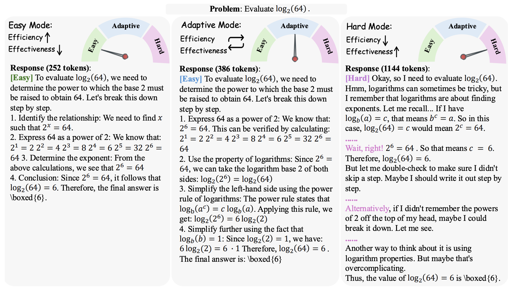

# AdaCtrl: Towards Adaptive and Controllable Reasoning via Difficulty-Aware Budgeting


## 🔥 News

- **June 30, 2025**: We release the training code
- **May 24, 2025**: We release our paper  📄 [arXiv](https://arxiv.org/pdf/2505.18822)



## 📋 Introduction

We propose AdaCtrl, a novel framework to support both difficulty-aware adaptive reasoning budget allocation and explicit user control over reasoning depth. AdaCtrl dynamically adjusts its reasoning length based on self-assessed problem difficulty, while also allowing users to manually control the budget to prioritize either efficiency or effectiveness. This is achieved through a two-stage training pipeline: an initial cold-start fine-tuning phase to instill the ability to self-aware difficulty and adjust reasoning budget, followed by a difficulty-aware reinforcement learning (RL) stage that refines the model’s adaptive reasoning strategies and calibrates its difficulty assessments based on its evolving capabilities during online training. To enable intuitive user interaction, we design explicit length-triggered tags that function as a natural interface for budget control.

## 🎯Quick Start

#### Environment 

```
cd verl
pip3 install ray[default]
pip3 install torch==2.5.1 torchvision==0.20.1 torchaudio==2.5.1 --index-url https://download.pytorch.org/whl/cu124
pip3 install flash-attn==2.7.4.post1 --no-build-isolation
pip3 install omegaconf==2.4.0.dev3 hydra-core==1.4.0.dev1 antlr4-python3-runtime==4.11.0 vllm==0.7.3
pip3 install math-verify[antlr4_11_0]==0.7.0 fire deepspeed tensorboardX prettytable datasets transformers==4.49.0
pip3 install -e verl

```

#### Training

Start ray and run the following scripts:

```
bash qwen-7b.sh
```

## 🙏 Acknowledgements

This work is inspired and supported by the following amazing works:

- [verl](https://github.com/volcengine/verl): A very fast reinforcement learning framework.
- [DeepMath](https://github.com/zwhe99/DeepMath): A Good Mathematical Dataset for Advancing Reasoning.

## 📖 Citation

If you find this repository helpful, please consider citing our paper:

```
@misc{huang2025adactrladaptivecontrollablereasoning,
      title={AdaCtrl: Towards Adaptive and Controllable Reasoning via Difficulty-Aware Budgeting}, 
      author={Shijue Huang and Hongru Wang and Wanjun Zhong and Zhaochen Su and Jiazhan Feng and Bowen Cao and Yi R. Fung},
      year={2025},
      eprint={2505.18822},
      archivePrefix={arXiv},
      primaryClass={cs.AI},
      url={https://arxiv.org/abs/2505.18822}, 
}
```
